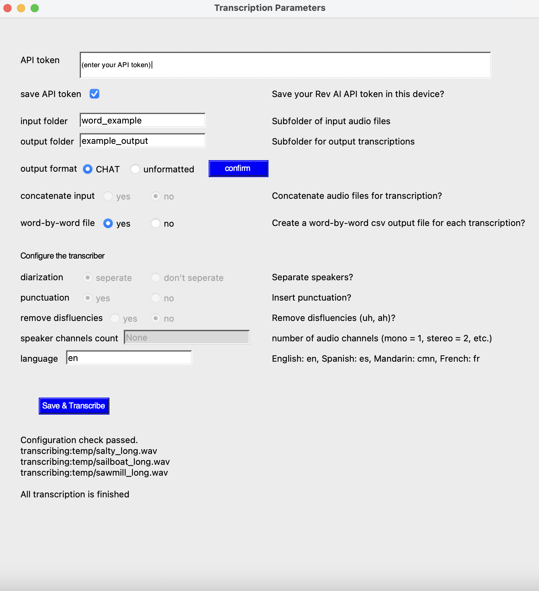
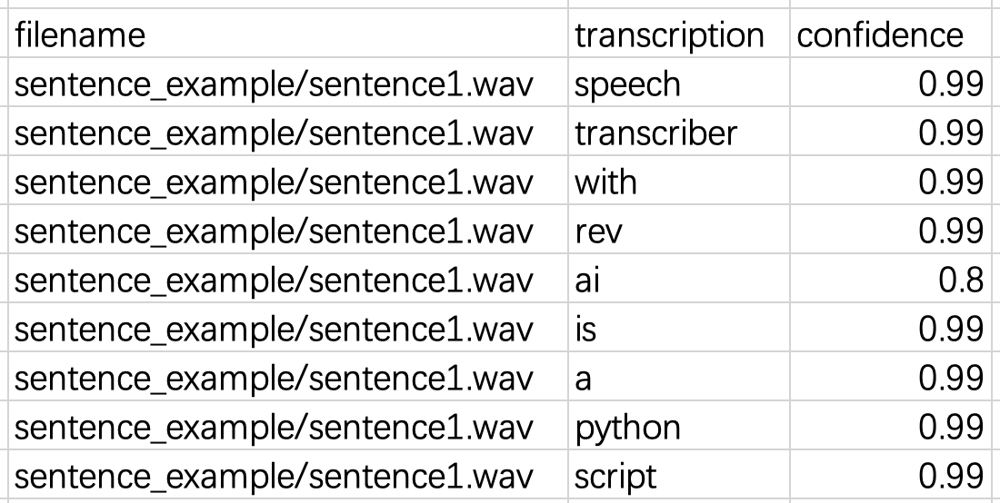
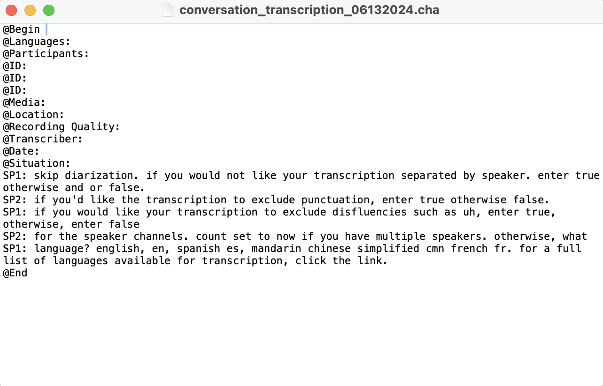
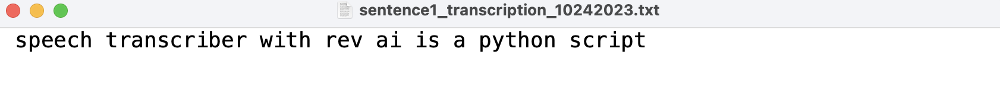
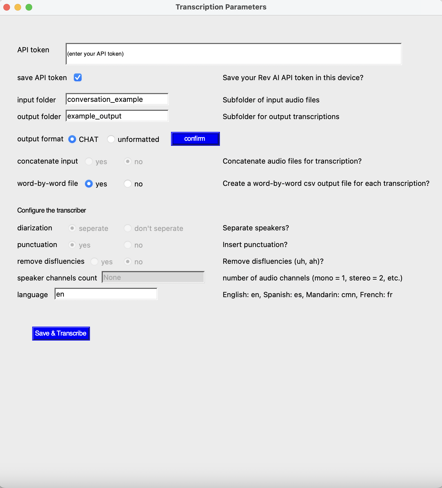
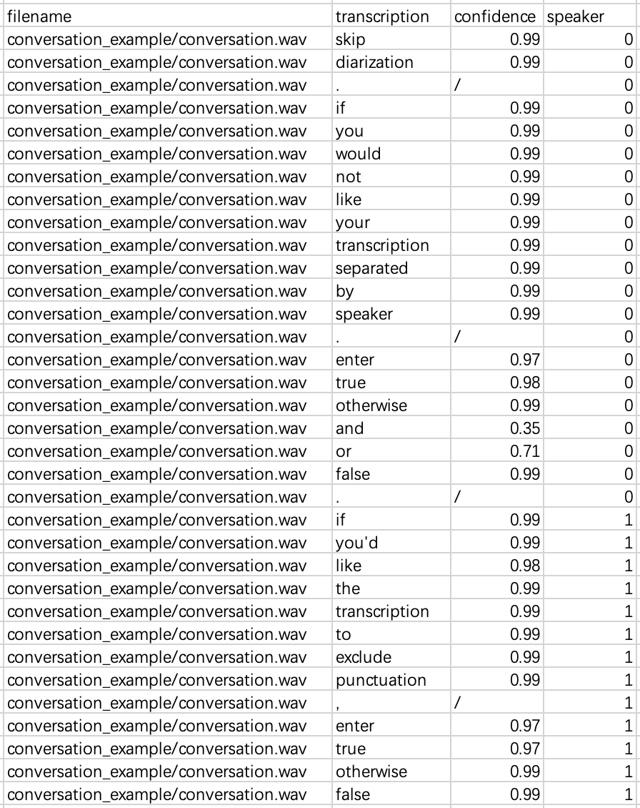
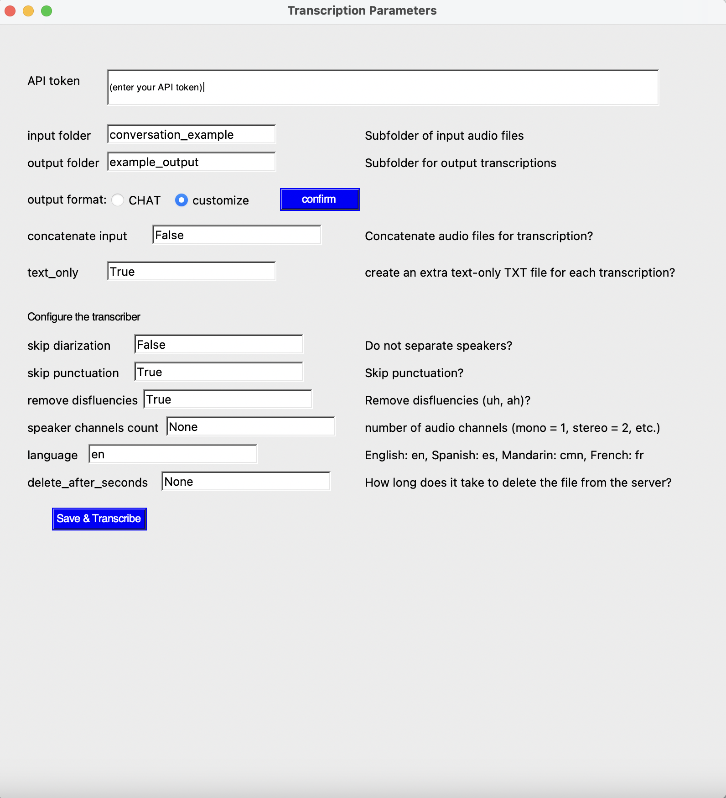
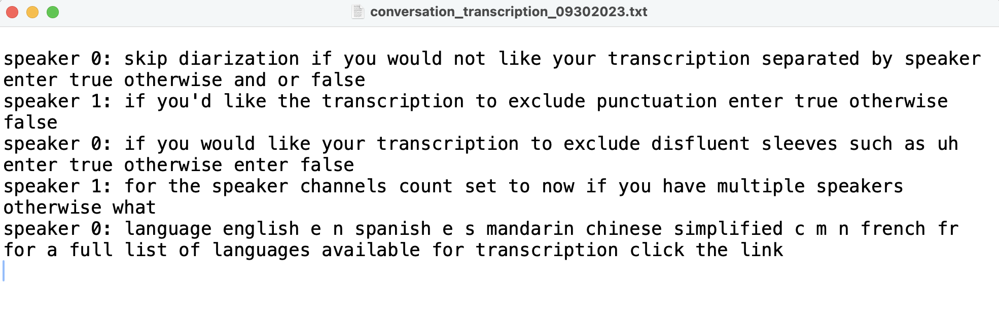

# Speech Transcriber with Rev AI (STR)

A Python script that simplifies speech-to-text transcription of audio files using the Rev AI engine. Using a GUI or the command line, transcription of a folder of files is performed in one call, and  transcriptions are saved in .csv and .txt files.

## Contents
1. [Requirements](#Requirements)
2. [Setup](#Setup)
3. [Usage](#Usage)
4. [Output](#Output-formats)
5. [Example of STR usage](#Transcription-Example)
6. [Other Languages](#Other-Languages)
7. [Variable Settings for Common Use Cases](#Variable-Settings-for-Common-Use-Cases)
8. [Further Documentation](#Further-Documentation)


## Requirements
1. Operating system: Windows 10 or Mac OS 10.9 (Mavericks) and later, Linux.

2. Python >= 3.7. We recommend installing [miniconda](https://docs.conda.io/projects/miniconda/en/latest/) if Python it is not installed on your computer.

3. Familiarity with using the command line: Check [command line tools tutorial](https://www.codecademy.com/article/command-line-commands) for instructions.

4. Audio file formats supported by STR: .wav, .mp3, .ogg, .opus, .flac, and .webm.

<br/><br/>

## Setup

### Obtain a Rev AI API token

1. Create an account at [Rev AI](https://www.rev.ai/).

2. Go to the Access Token tab. Generate an access token and save it in a safe place. You will need it later.

A new account is credited with $6.00 of free transcription. After exceeding this limit, you will be charged. See [Rev AI pricing](https://www.rev.ai/pricing) for details.

<br/><br/>

### Install dependencies
Two Python dependencies are required.

**pydub** is needed to manipulate audio files. Run this line of code at the command line:
```bash
pip3 install pydub
```

**rev_ai** is needed to submit transcription requests to the Rev AI server. Run this line of code at the command line:
```bash
pip3 install rev_ai
```

<br/>

### Install FFmpeg

Skip this step if you are transcribing **only** .wav files.

If you are transcribing audio files that were recorded in a format other than .wav (e.g. .mp3, .ogg), install FFmpeg. Follow the steps described [here](https://www.hostinger.com/tutorials/how-to-install-ffmpeg) based on your operating system. See [Requirements](#Requirements) for details on the file formats supported by STR.

<br/>

### Install STR

Clone the repository if you are familiar with Git. Otherwise follow these steps.

1. Click the green "Code" button above.

2. In the dropdown menu, click on "Download ZIP". The repository will be downloaded as a ZIP file to your computer.

3. Unzip the ZIP file and place the project folder in your working directory.

4. Within the project folder, create an input subfolder to store the audio files you wish to transcribe. Place the audio files for transcription in this subfolder.

5. Within the project folder, create an output subfolder to store transcriptions.  Transcription output will be generated in this subfolder.

<br/>


## Usage

Use of the GUI allows you to enter your access token, input and output folders, and alter transcription variables without directly editing the configuration file.

1. Run the script from an IDE or from the command line using this line of code after navigating to your project folder

```bash
python3 str.py
```

2. Alter the variables in the pop-up window to fit your transcription needs. See below for a description of each variable.

### Transcription variables

These variables must be specified

  - **API token** - Your API token.
  - **input_folder** - The name of the folder that stores your audio files.
  - **output_folder** - The name of the folder that will store transcriptions.
  - **output_format** - Output format of the text-only (.txt) file. Choose `CHAT` to have a CHAT format output file. Choose `unformatted` to have a customized unformatted output file. Be sure to click `confirm` before start transcribing.

Optional settings to customize transcription

  - **concatenate_input** - Default: `False`. Specifies whether audio files will be combined into one long audio file prior to transcription. Concatenation speeds up transcription and is less costly when individual sound files contain one or two spoken words. Specify `True` to concatenate your audio files. Specify `False` to transcribe each audio file separately.
  - **text_only** - Default: `False`. Specify if a text-only (.txt) file will be generated in addition to a .csv file. Specify `True` to have transcriptions also output in a .txt file. Specify `False` to have transcription only in .csv files. Most useful for transcribing sentences and conversations. See [output](#Output-formats) for details on output formats and examples.

Transcription settings

  - **skip_diarization** - Default: `True`. Specify if output will indicate speaker identity alongside the transcription. If speaker identity is not relevant, such as if the audio contains only one speaker, set to `True`. When `False`, the transcription engine will distinguish the speech among speakers. (i.e., speaker 0, speaker 1, etc.). Note that  speaker_channels_count must also be specified correctly for diarization to succeed.
  - **skip_punctuation** - Default: `True`. Specify whether the output will include punctuation. Specify `True` if you would like the transcription to exclude punctuation, otherwise specify `False`. Only available for **English**.
  - **remove_disfluencies** - Default: `True`. Specify whether the output will contain speech disfluencies that are recognized by the transcription engine ("um" and "uh"). specify `True` if you would like your transcription to exclude disfluencies, otherwise specify `False`. Only available for **English**.
  - **speaker_channels_count** - Default: `1`. Specify the number of audio channels in the audio file. Mono = 1, Stereo = 2, (up to 8). Specify `None` when there are multiple speakers in a single channel. The value of skip_diarization will be ignored if an integer value is provided here. Only available for **English**.
  - **language** - Default: `en`. Language of transcription. English = `en`, Spanish = `es`, Mandarin Chinese Simplified = `cmn`, French = `fr`. For a full list of languages available for transcription, see [Rev AI supported languages](https://www.rev.ai/languages).
  - **delete_after_seconds** - Default: `None`. The number of seconds before the audio file is deleted from the server. None = no time specified (audio will be deleted according to user’s account settings - default is 30 days).

These additional transcription variables are included in str.py but commented out because they may be of secondary importance to most users. Uncomment and set them as needed. For a full explanation of these variables, visit [transcription variables](https://docs.rev.ai/api/asynchronous/reference/#operation/SubmitTranscriptionJob).

  - **verbatim** - Default: `True`. Specify `True`, if you would like to transcribe all utterance (disfluencies, repetitions, etc). otherwise specify `False`.
  - **remove_atmospherics** - Default: `False`. Specify `True`, if you would like to remove `<laugh>`, `<affirmative>`, etc., otherwise specify `False`.
  - **filter_profanity** - Default: `False`. Specify `True`, if you would like to filter profanity, otherwise specify `False`.
  - **custom_vocabularies** - Default: `None`. Provide your own vocabulary to improve transcription accuracy of these words (e.g. unique names, specific terminologies, etc.). Check [custom vocabulary](https://docs.rev.ai/api/custom-vocabulary/#:~:text=Custom%20vocabularies%20are%20submitted%20as,to%201000%20for%20other%20languages) for details.


3. Click "Save & Transcribe" to transcribe your audio files.

Transcription messages will appear below the "Save & Transcribe" button that inform you of what the program is currently doing and when the program has finished transcription.

You will see "Configuration check passed." if all GUI entries have valid values. If there are errors in the GUI entries, error messages will appear and instruct you where the errors are. Once the errors are fixed, click "Save & Transcribe" again to transcribe your audio.

Example output:

<p align="center">

</p>

Once all audio files are transcribed, you will see the message "All transcription is finished", and your transcription file will appear in your output folder.

Example output:

<p align="center">

</p>

<br/><br/>

## Output formats

### csv output

.csv transcriptions are saved in the output folder. You can use the processing date to locate the result file(s) within the output folder.

A transcription file consists of three columns: **Filename**, **Transcription**, and **Confidence** as shown below. Each line contains the transcription of a word in the listed audio file.

  - **Filename** the audio file that was transcribed
  - **Transcription** contains a word in the transcribed speech.
  - **Confidence** A score (0 to 1) that denotes transcription confidence. Applies only to individual words.

When transcribing a conversation, an additional column **Speaker** will contain speaker identity alongside the transcription.

Example output:

<p align="center">

</p>

<br/>

### text output

If the **text_only** variable is specified `True`, an additional .cha file with the same name will be generated for every .csv file created. The .cha files will contain results in CHAT format.

Example output:

<p align="center">

</p>

If **output_format** is specified as `unformatted`. The unformatted text file will be output in a .txt file.

<p align="center">

</p>

<br/>

## Transcription Example

This example is provide to illustrate a commmon use case. The audio file is in the designated folder included with the repository. Output will be saved in the given output folder - example_output.

See also the [Use Cases](#Variable-Settings-for-Common-Use-Cases) section below.

<br/>

### Transcribe an audio file containing a two-speaker conversation

Enter your API token, then set the variables as shown below.

Configuration settings:

<p align="center">

</p>

Run the code. Transcription will take approximately 1 minute and will cost no more than 1 cent.

First several lines of the example csv output:

<p align="center">

</p>

Example CHAT output:

<p align="center">

</p>

If you want to output the unformatted text file instead of a CHAT formatted file, set the variables as shown below.

<p align="center">

</p>

Example unformatted output:

<p align="center">

</p>

<br/><br/>


## Language Availability

Rev AI engine supports speech transcription in 36 languages. ([Rev AI supported languages](https://www.rev.ai/languages)). Some variables are available only for English. Unavailable variables will be automatically ignored.


<br/><br/>

## Variable Settings for CHAT use cases

This table provides the variable settings for CHAT format transcription in different languages. **Not available** indicates that variable settings are not supported in the use case.

|                    | *English*       | *Other languages* |
| -----------------  | --------------- | --------------- |
| concatenate_input  |  False          | False           |
| text-only          | True            | True            |
| skip_diarization   | False           | False           |
| skip_punctuation   | True            |**not available**|
| remove_disfluencies| True            |**not available**|
| speaker_channels_count| None         |**not available**|
| language           | en              | es/fr/de/etc.   |
| delete_after_seconds| None           | None            |


<br/><br/>

## Further Documentation

The [manuscript](https://buckeyemailosu-my.sharepoint.com/:b:/g/personal/gu_1016_buckeyemail_osu_edu/ESThNiQW7YNFuxzoTDelUpwBik6gflpb4HTQkhRYaRcOmQ?e=SaJk0e) accompanying this repository provides additional detail on script usage and transcription variables.
See also [Rev AI documentation](https://docs.rev.ai/get-started/).
