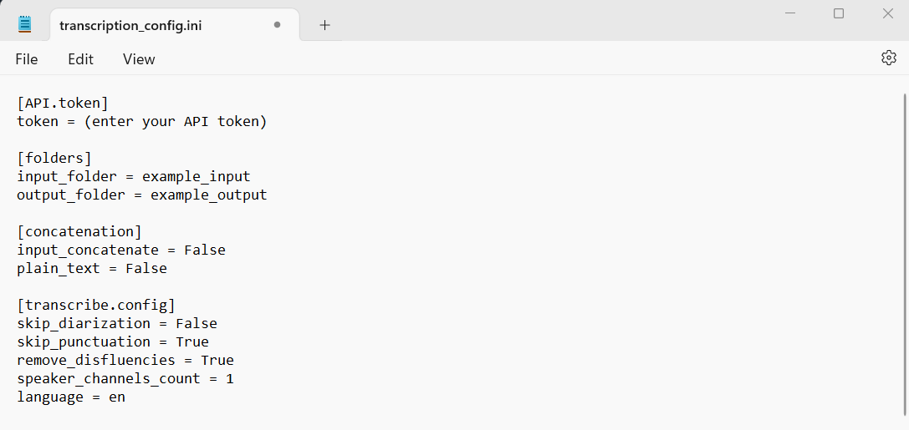
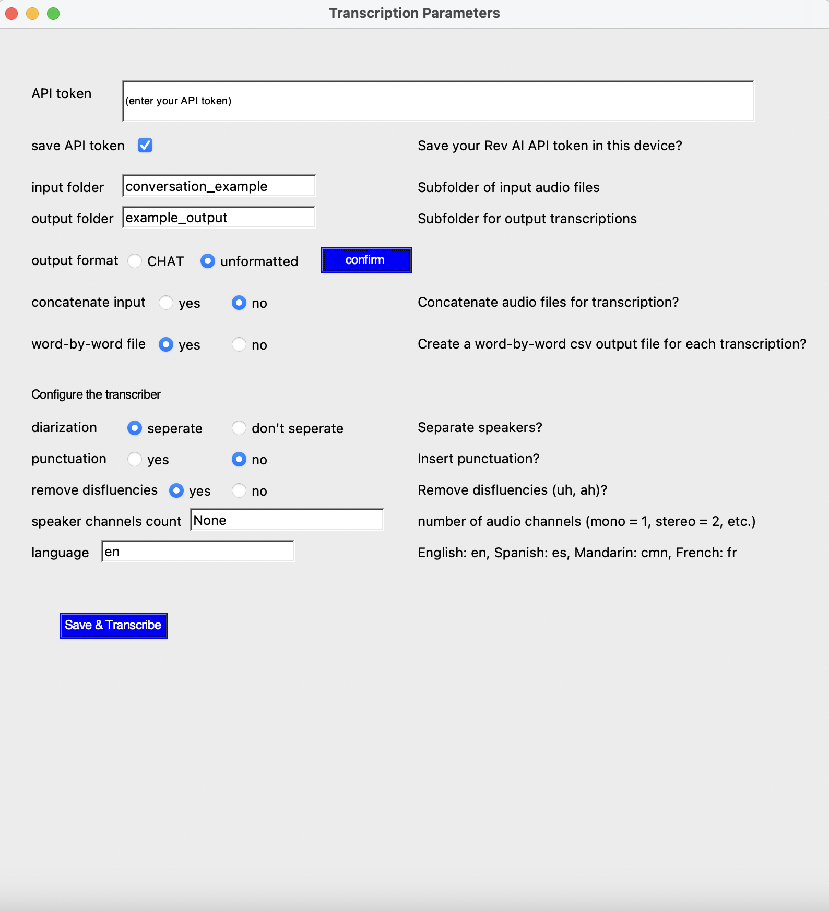
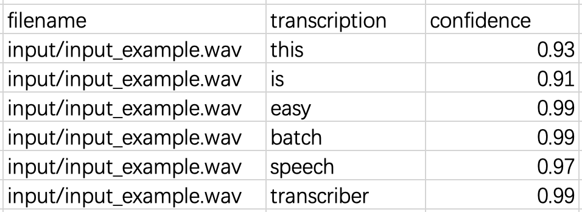
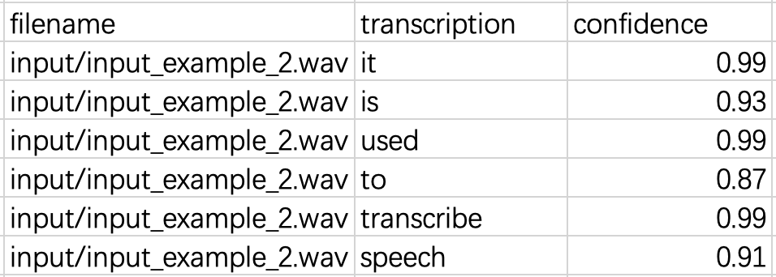
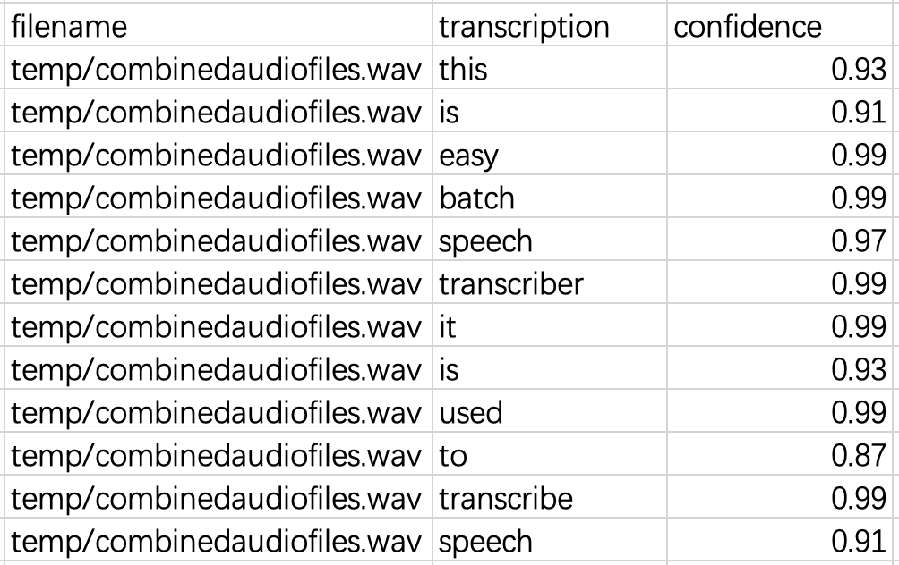

# Easy Batch Speech Transcriber

A Python script that simplifies speech-to-text transcription of many audio files using the rev.ai engine. Using a GUI or the command line, transcription of a folder of files is performed in one call, with the output saved in csv or txt files.

## Requirements
1. Windows 10 or Mac OS 10.9 (Mavericks) and later
2. Python >= 3.7\
To install Python, visit the official Python website at [python.org](https://www.python.org/downloads/).

3. Familiarity with using the command prompt (terminal command line for Mac OS) ([Windows](https://www.freecodecamp.org/news/command-line-commands-cli-tutorial/) and [Mac OS](https://www.alphr.com/open-command-prompt-mac/) instructions)

<br/><br/>

## Setup

### Install FFmpeg

Skip this step if you are transcribing **only** .wav files.

If you are transcribing files other than .wav files (e.g. .mp3, .ogg, .opus, .flac, and .webm), install FFmpeg. Follow the steps described [here](https://www.hostinger.com/tutorials/how-to-install-ffmpeg) based on your operating system.

<br/>

### Install dependencies
Two Python dependencies are required.

**Pydub** is needed for the program to manipulate the audiofiles. Run this line of code at a command prompt:
```bash
pip install pydub
```

**Rev_ai** is needed for the program to submit transcription requests to the Rev AI Asynchronous Speech-to-Text API. Run this command at a command prompt:
```bash
pip install rev_ai
```

<br/>

### Create project folder
1. Create a project folder for EBST if one is not yet created
2. Within the project folder, create an input subfolder to hold audio files for transcription. Place your audio files for transcription into this subfolder.
3. Within the project folder, create an output subfolder to store transcriptions.

<br/>

### Install Easy Batch Speech Transcriber in your project folder

#### Install using your command prompt:

##### 1.  Navigate to your project folder.

##### 2. Run the following command in your at a command prompt:

````bash
pip install git+https://github.com/YuzheGu/Easy-Batch-Speech-Transcriber.git
````

#### Install from this page:

##### 1. Click the green "Code" button above.

##### 2. In the dropdown menu, click on "Download ZIP".

The repository will be downloaded as a ZIP file to your computer.

##### 3. Extract the contents of the ZIP file into your project folder.

#### Install from the GitHub Desktop App:

##### 1. Download, install and open the GitHub Desktop app on your computer

##### 2. Click on the "File" menu and select "Clone Repository".

##### 3. In the "Clone" tab, select the Easy-Batch-Speech-Transcriber repository from the list of available repositories.

##### 5. Choose the local path to your project folder, which is where you want to save the repository on your computer.

##### 6. Click on the "Clone" button to download the repository to your specified location.

<br/>

### Obtain a rev.ai API token
1. Create an account at [rev.ai](https://www.rev.ai/).
2. Go to the tab labelled Access Token. Generate an access token and save it in a safe place. You will need it later.

A new account can transcribe five hours of speech for free. After exceeding this limit, you will be charged. Visit the [rev_ai website](https://www.rev.ai/pricing) for details on pricing.

<br/><br/>

## Usage

Users who prefer to use the GUI should skip to the section called [GUI Usage](#GUI-usage). If you have limited programming experience, we recommend you use the GUI.

### Edit transcription_config.ini in a text editor

The transcription_config.ini file stores your API token, input and output folder names, and transcription preferences.

#### Open Transcription_config.ini in a text editor.

Example:

<p align="center">

</p>

You are required to provide these variables:

  - ** API token**:

  - **input_folder**:
  - **output_folder**:

The following variables have default values that assume you are transcribing a set of files with the output for each audio file saved in a separate csv file. Edit them to fit your transcription needs.

  - **input_concatenate** - Enter `True` or `False` Enter `True` to concatenate your audiofiles for transcription. Enter `False` to keep your audiofiles unconcatenated. Note that if you mark this entry as `True`, the program will **not** be able to tell which file the transcribed audio comes from. See [result](#CSV-result) for an example.
  - **plain_text** - If you would like your transcription output to be in a plain text file in addition to a CSV file, enter `True`, otherwise `False`. See [Result Interpretation](#Result-Interpretation) for an explanation of each output format type and examples.

[transcribe.config] - Transcription preferences

  - **skip_diarization** - If you would not like your transcription separeted by speaker, enter `True`, otherwise `False`.
  - **skip_punctuation** - If you would like the transcription to exclude punctuation, enter `True`, otherwise `False`.
  - **remove_disfluencies** - If you would like your transcription to exclude disfluencies (such as "uh"), enter `True`, otherwise `False`.
  - **speaker_channels_count** - Enter the number of audio channels (mono = 1, stereo = 2)
  - **langauge** - English = `en`, Spanish = `es`, Mandarin Chinese Simplified = `cmn`, French = `fr`. For a full list of languages available for transcription, click [here](https://www.rev.ai/languages).

When you are finished, **Save and Exit the text editor**.


<br/>

### Run the script

Run the script from an IDE or from the command prompt after navigating to your project folder:

```bash
python ebst.py
```

The results of your transcription will appear in your output file after each audio file is transcribed. This may take a few minutes.

<br/>

## GUI usage

Use of the GUI allows you to enter your access token, input and output folders, and alter transcription settings without opening the configuration file.

1.  Use command prompts to navigate to your project folder.

2. Run the following command in your command prompt or IDE:

```bash
python ebst_gui.py
```
3. Alter the settings in the pop-up window to fit your transcription needs. 

If you would like to test out our program with our example audio, enter your own API token and edit the GUI window to match this example:

<p align="center">

</p>

4. Click "Save & Transcribe" to transcribe your audio.

Transcription messages will appear below the "Save & Transcribe" button. Here, it will tell you what the program is currently doing and when the program has finished transcription.

You will see "Configuration check passed." if the GUI entries are all correct. If there are errors in the GUI entries, error messages will appear. Each error message will instruct you on how to fix the error. Once the errors are fixed, click "Save & Transcribe" again to transcribe your audio.

Example output:

<p align="center">

</p>

Once all audiofiles are transcribed, you will see the message "All transcription is finished", and your transcription file will appear in your output folder.

Example output:

<p align="center">

</p>

<br/><br/>

## Output

### CSV output

CSV format transcription results are found under the output folder you specified. You can use the processing date and time to locate the result file(s).

A transcription result file consists of three columns: **filename**, **transcription**, and **confidence** as shown below. Each line contains the transcription of the speech in the listed audio file.

  - **Filename** is the speech file that was transcribed
  - **Transcription** is the transcribed speech.
  - **Confidence** A score (0-1) that denotes transcription confidence. Applies only to individual words. 


Example output 1:

<p align="center">

</p>

Example output 2:

<p align="center">

</p>

Note that if you mark **input_concatenate** as True, **Filename** will always be 'combinedaudiofiles.wav', and the program will not be able to tell which file the transcribed words originally came from.

<p align="center">

</p>

<br/>

### Plain text output

If the **plain_text** entry in transcription_config.ini is marked as True, an addition plain text result file with the same name will be generated for every audio file transcription. The plain text result files contain only the transcribed words in a long line.

Example output:

```bash
this is easy batch speech transcriber it is used to transcribe speech
```
<br/>

## Test out EBST 

To ensure EBST works on your computer before using it on your own files, enter your API token and the names of the example folders provided with the repository ("example_input" and "example_output"). Leave all other default values the same. Run the code. X files containing Y words will be transcribed. It will take approximately A minutes and will cost about Z cents.


<br/><br/>

## Further Documentation


Please familiarize yourself with the accompanying manuscript to ensure your EBST settings are appropriate for your needs. There we describe use cases from transcribing single words to conversations between two people, discuss efficiencies and drawbacks to concatenation, job management and job/file deletion.
